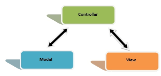

<!DOCTYPE html>
<html lang="pt-br">

<head>
    <meta charset="UTF-8">
    <meta name="viewport" content="width=device-width, initial-scale=1.0">

</head>

<body>
    <h2>Projeto InOut</h2>
    

        
Projeto Inout onde o usuário poderá fazer um ponto eletrônico de trabalho diario
            onde poderá cadastrar sua hora de inicio de entrada na empresa e sua hora de almoço
            e saida do local de trabalho
            onde poderá gerar relatório de ponto
            tempo trabalhado ao fim do mês
        

    

    <h3>projeto feito em linguagem PHP </h3>
    <h4>Utilizando arquiteturas e conexões :</h4>
    

     
    <h2>FRONTEND</h2>
     
    

     
    

        <ul>
            &nbsp;<strong
                style='text-align:justify;'> HTML</strong> 
             
            &nbsp;<strong
                style='text-align:justify;'>CSS</strong> 
             
            &nbsp;<strong
                style='text-align:justify;'>JS</strong> 
             
            &nbsp;<strong
                style='text-align:justify;'> BOOTSTRAP</strong> 
             
        </ul>
    
  
     
    <h2>BACKEND</h2>
     
    

     
    

        <ul> &nbsp;<strong
                style='text-align:justify;'> PHP</strong> 
             
            &nbsp;<strong
                style='text-align:justify;'> MVC</strong> 
             
            &nbsp;<strong
                style='text-align:justify;'> PDO</strong> 
             
            &nbsp;<strong
                style='text-align:justify;'> MYSQLI</strong> 
             
        </ul>
    
  
     
    <h2>BANCO</h2>
     
    

     
    

        <ul>
            &nbsp;<strong
                style='text-align:justify;'>MYSQL</strong> 
             
        </ul>
    
  
     
    <h2>SERVIDOR</h2>
     
    

    

        <ul>
            &nbsp;<strong
                style='text-align:justify;'>XAMPP</strong> 
             
        </ul>
    
  
     
    <h2>EDITOR</h2>
     
    

    

        <ul>
            &nbsp;<strong
                style='text-align:justify;'>Visual studio code</strong> 
        </ul>
    

</body>

</html>